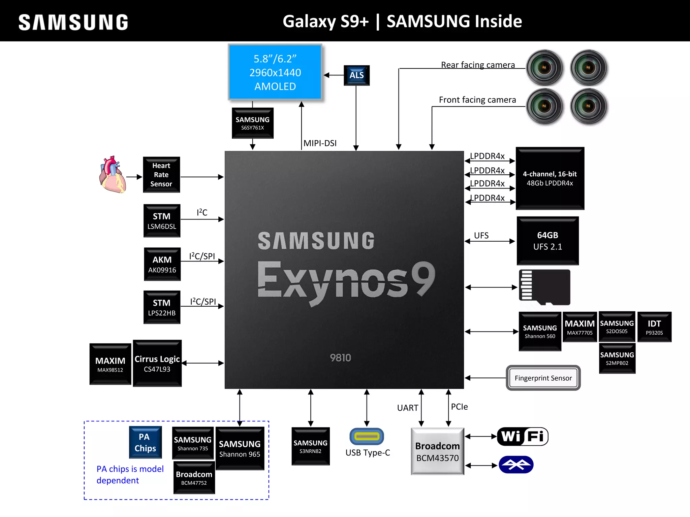

# Building the Mainline Linux Kernel

## Install Dependencies
```bash
sudo apt install \
  --no-install-recommends \
  --no-install-suggests \
  gcc-aarch64-linux-gnu \
  make \
  gcc \
  libssl-dev # flex bison bc
```

## Set Build Environment
```bash
export ARCH=arm64
export CROSS_COMPILE=aarch64-linux-gnu-
```

## Initialize Kernel Configuration

Use [starlte.config](https://github.com/ruslanbay/exynos9810-starlte/blob/main/configs/starlte.config) for this step.

```bash
# Clean artifacts (optional)
make mrproper

# Generate base config
make defconfig

# Merge custom fragments
./scripts/kconfig/merge_config.sh .config starlte.config

# Customize settings (optional)
make menuconfig
```

## Device Tree Validation

### Syntax check only
```bash
make exynos/exynos9810-starlte.dtb
```

### Full schema validation

#### Install required packages

```bash
sudo apt install \
  --no-install-suggests \
  --no-install-recommends \
  python3-pip \
  python3-venv \
  python3-dev
```

#### Create and activate virtual environment
```bash
python3 -m venv ~/dt-env

source ~/dt-env/bin/activate
```

#### Install dtschema
```bash
pip install dtschema
```

```bash
make CHECK_DTBS=y -j$(nproc) exynos/exynos9810-starlte.dtb
```

#### Cleanup
```bash
deactivate
```

## Compile Kernel
```bash
make -j$(nproc)
```

---


# Hardware

| Component              | Hardware                      | Mainline status                                                  |
| ---------------------- | ----------------------------- | ---------------------------------------------------------------- |
| SoC                    | Exynos 9810                   | ✅ [`arch/arm64/boot/dts/exynos/exynos9810.dtsi`](https://github.com/torvalds/linux/blob/master/arch/arm64/boot/dts/exynos/exynos9810.dtsi)<br>✅ [`arch/arm64/boot/dts/exynos/exynos9810-starlte.dts`](https://github.com/torvalds/linux/blob/master/arch/arm64/boot/dts/exynos/exynos9810-starlte.dts)<br>✅ [`arch/arm64/boot/dts/exynos/exynos9810-pinctrl.dtsi`](https://github.com/torvalds/linux/blob/master/arch/arm64/boot/dts/exynos/exynos9810-pinctrl.dtsi)  |
| CPU                    | 4 x Exynos M3 "Meerkat" (ARMv8.0)</br>4 x Cortex-A55 (ARMv8.2)| ✅ |
| GPU                    | Mali-G72 MP18                 | ✅ [`drivers/gpu/drm/panfrost`](https://github.com/torvalds/linux/tree/master/drivers/gpu/drm/panfrost)                                  |
| Display Panel	         | Samsung AMB622NP01            | ✅                                                             |
| Touchscreen controller | Samsung S6SY761X              | ✅ [`drivers/input/touchscreen/s6sy761.c`](https://github.com/torvalds/linux/blob/master/drivers/input/touchscreen/s6sy761.c)                        |
| Display Driver Integrated Circuit | Samsung S6E3HA8    | ✅ [`drivers/gpu/drm/panel/panel-samsung-s6e3ha8.c`](https://github.com/torvalds/linux/blob/master/drivers/gpu/drm/panel/panel-samsung-s6e3ha8.c)              |
| Wi-Fi / Bluetooth      | Broadcom BCM43570             | ✅ [`drivers/net/wireless/broadcom/brcm80211/brcmfmac`](https://github.com/torvalds/linux/tree/master/drivers/net/wireless/broadcom/brcm80211/brcmfmac)          |
| FM transceiver / Tuner | RichWave RTC6213N             | ❌                                                     |
| NFC module name	       | Samsung 82LBXS2               | ❌                                                     |
| NFC controller         | Samsung S3NRN82               | ✅ [`drivers/nfc/s3fwrn5`](https://github.com/torvalds/linux/tree/master/drivers/nfc/s3fwrn5)                                         |
| NFC secure element     | Samsung S3FV9RRP              | ❌                                                     |
| GNSS                   | Broadcom BCM47752             | ❌                                                     |
| Modem / RF transceiver | Shannon 965                   | ❌                                                     |
| Front-End Module       | AFEM-9090                     | ❌                                                     |
| Power amplifier        | Skyworks SKY77365-11          | ❌                                                     |
| Power amplifier        | Murata fL05B                  | ❌                                                     |
| Envelope tracking      | Shannon 735                   | ❌                                                     |
| PMIC                   | MAX77705F                     | ✅ [`drivers/mfd/max77705.c`](https://github.com/torvalds/linux/blob/master/drivers/mfd/max77705.c)<br>✅ [`drivers/power/supply/max77705_charger.c`](https://github.com/torvalds/linux/blob/master/drivers/power/supply/max77705_charger.c)<br>✅ [`drivers/power/supply/max17042_battery.c`](https://github.com/torvalds/linux/blob/master/drivers/power/supply/max17042_battery.c) |
| PMIC for modem         | Shannon 560                   | ❌                                                     |
| PMIC for display       | Samsung S2DOS05               | ✅ [`drivers/regulator/s2dos05-regulator.c`](https://github.com/torvalds/linux/blob/master/drivers/regulator/s2dos05-regulator.c)                       |
| PMIC for camera        | Samsung S2MPB02               | ❌                                                     |
| Wireless charging      | IDT P9320S                    | ❌                                                     |
| 6-Axis Gyroscope & Accelerometer | STMicroelectronics LSM6DSL | ✅ [`drivers/iio/imu/st_lsm6dsx`](https://github.com/torvalds/linux/tree/master/drivers/iio/imu/st_lsm6dsx)                           |
| 3-Axis Electronic Compass / Magnetometer | AKM AK09916 | ✅ [`drivers/iio/magnetometer/ak8975.c`](https://github.com/torvalds/linux/blob/master/drivers/iio/magnetometer/ak8975.c)                              |
| Pressure / Barometer   | STMicroelectronics LPS22HB    | ✅ [`drivers/iio/pressure/st_pressure_core.c`](https://github.com/torvalds/linux/blob/master/drivers/iio/pressure/st_pressure_core.c)                        |
| Heart rate sensor      | Maxim MAX86917                | ❌                                                     |
| Fingerprint Sensor     | Egis Technology ET510A        | ❌                                                     |
| Audio codec            | Cirrus Logic CS47L93          | ✅ [`drivers/mfd/madera-core.c`](https://github.com/torvalds/linux/blob/master/drivers/mfd/madera-core.c)<br>✅ [`sound/soc/codecs/madera.c`](https://github.com/torvalds/linux/blob/master/sound/soc/codecs/madera.c)    |
| Audio amplifier        | MAX98512                      | ❓                            |
| Rear wide-angle camera | Samsung S5K2L3SX              | ❌                                                     |
| Rear telephoto camera  | Samsung S5K3M3SM              | ❌                                                     |
| Front Camera           | Samsung S5K3H1SX              | ❌                                                     |
| Iris Scanner           | Samsung S5K5F1SX              | ❌                                                     |
| RAM                    | Samsung K3UH6H60AM-AGCJ       | ✅                                                              |
| NAND storage           | Samsung KLUCG2K1EA-B0C1 (UFS) | ✅ [`drivers/ufs`](https://github.com/torvalds/linux/tree/master/drivers/ufs)                                                   |



---

# Links

Stock software updates history for Exynos9810-based devices:

* [S9 (SM-G960F), G960FXXUHFVG4, Android 10 (Q), 2022-03-01](https://doc.samsungmobile.com/sm-g960f/dbt/doc.html)
* [S9+ (SM-G965F), G965FXXUHFVG4, Android 10 (Q), 2022-03-01](https://doc.samsungmobile.com/sm-g965f/dbt/doc.html)
* [Note9 (SM-N960F), N960FXXU9FVH1, Android 10 (Q), 2022-07-01](https://doc.samsungmobile.com/sm-n960f/dbt/doc.html)
* [Note10 Lite (SM-N770F), N770FXXS9HXA3, Android 13 (T), 2024-02-01](https://doc.samsungmobile.com/sm-n770f/xef/doc.html)
* [Tab Active3 (SM-T570), T570XXSFEYI1, Android 13 (T), 2025-10-01](https://doc.samsungmobile.com/SM-T570/XSP/doc.html)
* [Tab Active3 (SM-T575), T575XXSFEYI1, Android 13 (T), 2025-10-01](https://doc.samsungmobile.com/sm-t575/dbt/doc.html)
* [Tab Active3 (SM-T577U), T577UVLSFEYI1, Android 13 (T), 2025-10-01](https://doc.samsungmobile.com/SM-T577U/XAC/doc.html)

Downstream kernels:

* https://github.com/ruslanbay/linux/tree/G960FXXUHFVB4
* https://github.com/ruslanbay/linux/tree/G960FXXUHFVK1
* https://github.com/ruslanbay/linux/tree/T570XXSDEYC1
* https://github.com/ruslanbay/linux/tree/N770FXXS9HXA3

Download downstream kernels (zip):

* https://opensource.samsung.com/uploadSearch?searchValue=sm-g96
* https://opensource.samsung.com/uploadSearch?searchValue=sm-n96
* https://opensource.samsung.com/uploadSearch?searchValue=n770
* https://opensource.samsung.com/uploadSearch?searchValue=t57

Other links:

* https://wiki.postmarketos.org/wiki/Samsung_Galaxy_S9_(samsung-starlte)
* https://wiki.postmarketos.org/wiki/Samsung_Exynos_9810
* https://wiki.lineageos.org/devices/starlte/
